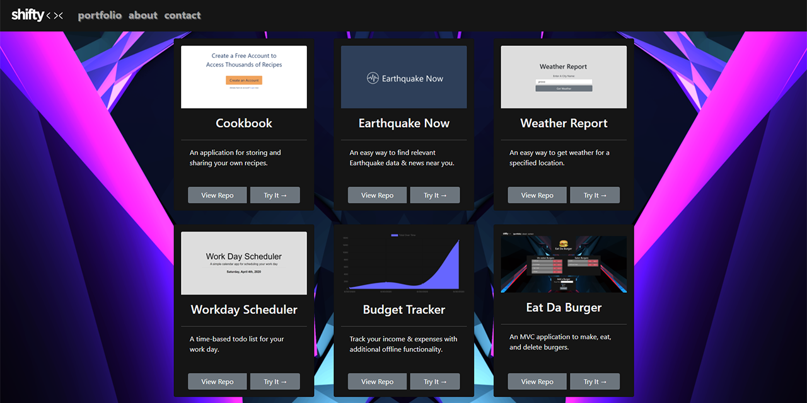

# My Portfolio

[VISIT THE LIVE SITE](https://shiftymitch-employee-directory.herokuapp.com/)

---

---

### Table of Contents

- [Description](#description)
- [How to Use](#how-to-use)
- [Check It Out](#check-it-out)
- [Technologies](#technologies)
- [License](#license)
- [Contributors](#contributors)

---

### Description

My porfolio site was built with the React framework, with a mixture of styling from Bootstrap & custom CSS.

Please allow 30 seconds or so for the Heroku server to respond when first visiting the site. :)

Each project includes a link to the Github repo and the live application.

---

### Check It Out

The site is live [HERE](https://shiftymitch-portfolio.herokuapp.com/)

---

### Technologies

[React](https://reactjs.org/)\
[Bootstrap](https://getbootstrap.com/)

---

### License

MIT © [shiftymitch](https://github.com/shiftymitch)

---

### Contributors

| Developer | GitHub |
| ------ | ------ |
| Mitch Henderson | [shiftymitch](https://github.com/shiftymitch) |

[Back to the Top](#project-name)
